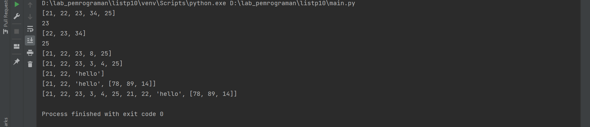
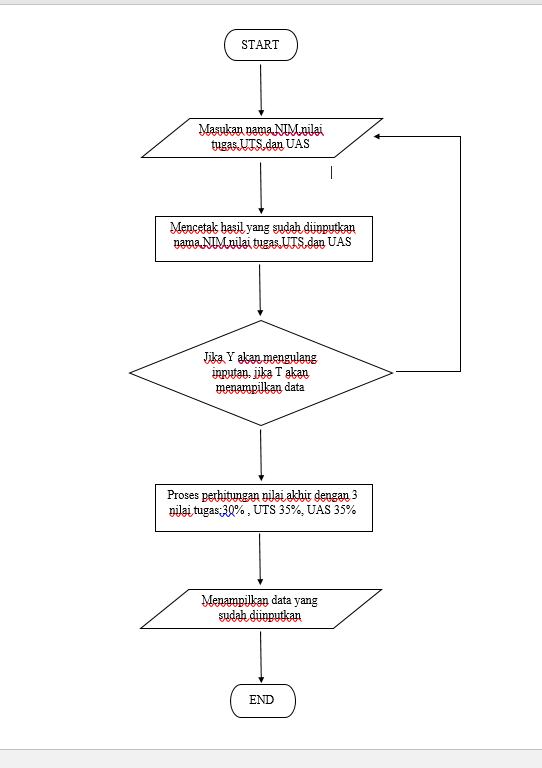

#Latihan 1
Berikut code dan penjelasannya

Hasil Output 

#Latihan 2

Membuat program sederhana untuk menambahkan data ke dalam list 
Berikut adalah Flowchart dari program yang dibuat 

dan dibawah ini adalah code dari program yang dibuat 

Hasil Output 

Penjelasan 
Line 1-4 membuat variabel yang di perlukan  
line 5-11 membuat liat yang akan diisi nantinya  
line 14 membuat perulangan while dengan wariabel jawab true y   
line 15 membuat auto increment  
line 16 menambahkan variabel hitung ke list no  
line 17 membuat inputan nama line 18 menambahkan isi variabel nama ke list   
line 19 membuat inputan nim  
line 20 menambahkan isi variabel nim ke list nim  
line 21 membuat inputan nilai dengan float sebagai bilangannya   
line 22 membuat perhitungan nilai akhir dengan 30% dari nilai tugas   
line 23 menambahkan isi variabel tugas ke list tugas 
line 24 membuat inputan nilai dengan float sebagai bilangannya  
line 25 membuat perhitungan nilai akhir dengan 35% dari nilai uts   
line 26 menambahkan isi variabel uts ke list uts 
line 27 membuat inputan nilai dengan float sebagai bilangannya  
line 28 membuat perhitungan nilai akhir dengan 35% dari nilai uas   
line 29 menambahkan isi variabel uas ke list uas 
Line 31 membuat variabel n_akhir dengan perhitungan dari nilai tugas uts dan uas  
Line 32 menambahkan isi variabel n_akhir ke list nilai akhir 
Line 34-38 menampilkan data yang sudah diingatkan sebelumnya  
Line 40 membuat pertanyaan untuk menambah data 
Line 42-43 membuat logika jika user menginputkan t maka nilai stop berubah jadi true dan akan menampilkan isi list 
Line 45-47 membuat kepala tabel 
Line 48-63 membuat perulangan untuk menggabungkan beberapa list dan menampilkan isi list dengan for 
line 64 menutup kaki tabel 
